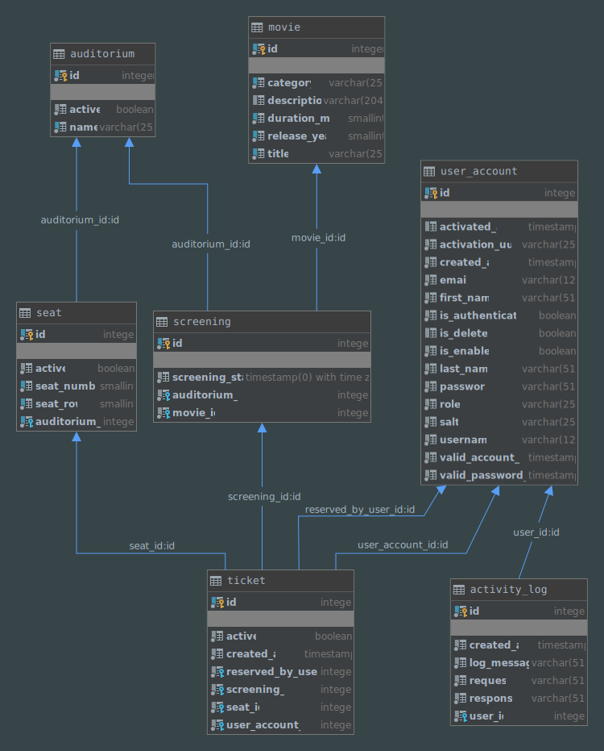
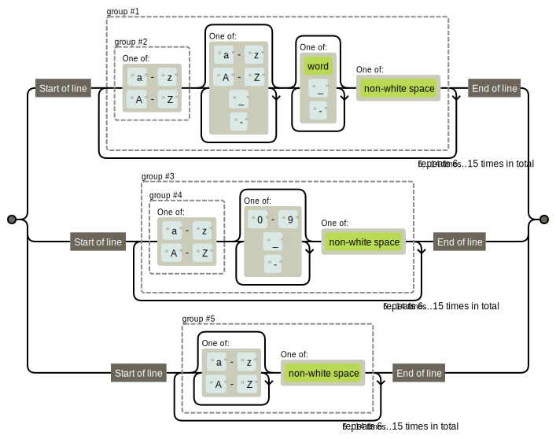
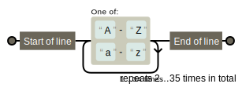

<h1 align="center">
  
  <br>
  KINEX Cinema Rest API
  <br>
</h1>

# DESCRIPTION

Cinema Rest API project for
- Demonstrating the use of Hibernate and Spring Data JPA
- Applying Spring Security with JWT token

### REQUESTS

### APPLICATION SEQUENCE ACTIONS
During first run ```USER``` needs to register application ```OWNER``` account. The sequence is as follows:

During the test-development phase it is easy to use <a href="https://temp-mail.org/">https://temp-mail.org/</a> as a temporary email for the register in you want test this functionality. 

1. Register using user owner registration request  
2. After success user will receive in response the activation token on the provided email
    - token is valid ```25 min``` in default 
3. Activate the account using provided activation token
    - if activation is performed after ```25 minutes``` of token receive, ```new token will be sent on provided email```
    - go to step 3 again with a new token
4. User can authenticate with provided credentials 
5. If authentication is succeed, user receive jwt token for using api. Now user can perform all possible actions described in postman requests provided in folder ```POSTMAN``` 

After OWNER is registered REST API allows registering and manage all other possible roles:
```
    1. USER
    2. MANAGER
    3. ADMINISTRATOR
    4. OWNER
```

### ENTITY RELATIONSHIP DIAGRAM
The ER diagram that fits domain classes looks as follows:



# GETTING STARTED

These instructions will get you a copy of the project up and running on your local machine for development and testing purposes.

### PREREQUISITES

```
Java JDK (8+)
Maven
Git
PostgreSQL
Lombok plugin for IDEA
```

### SECURITY

In order to hide the explicit entering of passwords in the program options,
the automatic encryption-decryption function of the passwords was used. 
The  library <a href="http://www.jasypt.org/cli.html">Jasypt</a> added to project dependency pom.xml for this purpose.
The encryption-decryption could be done using directly <a href="http://www.jasypt.org/cli.html">Jasypt</a> cli  or
by using provided external application <a href="https://github.com/DimaLumelskyj/password.generator.jasypt.git"> ```REST API (GitHub link)``` </a>.
The securing of the data can be done by putting encrypted sensitive data in the ```application.properties``` 
file inside tag ```ENC(``` ```yours encrypted data``` ```)```.

#### Example of use:

- Input: sample property to encrypt in raw unencrypted form - `sample.option.in.application.properties=@Java2019`

Action sequence to secure/hide the desired application property is as follows:

  1. encrypt the property value, for example `@Java2019` using encryption password `@x8HcZsUlfdE`.
  <br/>The result of the following <a href="https://github.com/DimaLumelskyj/password.generator.jasypt.git"> ```REST API (GitHub link)``` </a> is the table with provided secret and decrypted and encrypted text: 

     | Secret password | @x8HcZsUlfdE  |         
     | -------------   |:-------------:|
     | Decrypted text  | @Java2019     |
     | Encrypted text  | O8PUiDHzgAKmzQpKap+zxqnltgfMhxpI373/nnhghxjLuMJHyOuV8ya9tG9QM0TX |
             
  2. put the encrypted text inside tag ENC("Encryptred-Text")

- Encrypted property: - `sample.option.in.application.properties=ENC(O8PUiDHzgAKmzQpKap+zxqnltgfMhxpI373/nnhghxjLuMJHyOuV8ya9tG9QM0TX)`     

### APPLICATIONS PROPERTIES
All app configuration is in `application.properties` file inside `resources` folder.
Information about encrypted password is in SECURITY section of this readme. 
The properties are in several categories. Most important properties are:
- INITIAL SETUP
    - `application.timezone=UTC` \- application works in UTC timezone
    - `server.port=8080` \- definition of the port on which app works
- SECURITY SETUP
    - `jwt.token.validity.time.minutes=300` \- defines validity time of the authorisation token
    - `jwt.token.validity.activation.time.minutes=25` \- defines validity time of the account activation token
    - `jwt.secret={bcrypt}ENC( ENCRYPTED JWT PASSWORD )` \- secret for JWT token encryption/decryption 
- DATABASE SETUP
    - `spring.datasource.url` -- url and port of working postgres DB 
    - `spring.datasource.username=ENC( ENCRYPTED JWT PASSWORD )` \- username for DB connection
    - `spring.datasource.password=ENC( ENCRYPTED JWT PASSWORD )` \- password for DB connection
    - `spring.jpa.hibernate.ddl-auto=create` \- in developer mode we use option `create`, in production we propose use `none` or `update` option
    see <a href="https://docs.spring.io/spring-boot/docs/1.0.x/reference/html/howto-database-initialization.html">documentation <a/>
    - `spring.datasource.data=classpath:insert-test-data.sql` \- it is an option to set the test data file (SQL inserts), comment in the case of clean run
- EMAIL SEND SETUP        
  - `spring.mail.host=smtp.mailtrap.io` smtp email server address
  - `spring.mail.port=2525` port
  - `spring.mail.username=ENC( ENCRYPTED JWT PASSWORD )` username for email connection
  - `spring.mail.password=ENC( ENCRYPTED JWT PASSWORD )` password for email connection <a></a>
- PATTERN VALIDATION PROPERTIES
   - username validation regular expression checks if text is alphanumeric, starts with an alphabet and contains no special characters other than underscore or dash. Number of characters between 6 and 15.
  
   <a href="https://regexper.com/#%28%5E%28%5Ba-zA-Z%5D%29%5Ba-zA-Z_-%5D*%5B%5Cw_-%5D*%5B%5CS%5D%24%7C%5E%28%5Ba-zA-Z%5D%29%5B0-9_-%5D*%5B%5CS%5D%24%7C%5E%5Ba-zA-Z%5D*%5B%5CS%5D%7B6%2C15%7D%29%24">
    
   </a>
  
   - name validation regular expression checks if text is only alphabet characters begging from a big letter. Number of characters between 2 and 35.
  
  <a href="https://regexper.com/#%28%5E%28%5Ba-zA-Z%5D%29%5Ba-zA-Z_-%5D*%5B%5Cw_-%5D*%5B%5CS%5D%24%7C%5E%28%5Ba-zA-Z%5D%29%5B0-9_-%5D*%5B%5CS%5D%24%7C%5E%5Ba-zA-Z%5D*%5B%5CS%5D%7B6%2C15%7D%29%24">
       
   </a>

https://regexper.com/#%5E%28%5BA-Z%5D%5Ba-z%5D%29%7B2%2C15%7D%24
#### Email test data

As an email service provider <a href="https://mailtrap.io/">mailtrap.io</a> is used.
Sample credentials for test account is ass follows:
    
        Host:      smtp.mailtrap.io
        Port:      2525
        Username:  80087d6e5a6c67
        Password:  66c9872dbe4957   
    
Comment: `this data provided only in testing purposes, number of emails limited to 50, please make own account if currrent will not work.`       

#### Secured data in application properties

Here is the sample test passwords which used in the program to run the test case:

- secret password for application is ```@x8HcZsUlfdE``` 
- database user is ```kinex_user```
- used password is ```termos2137```
- JWT secret password is ```j2uMNsCBQPvA8rQX```


# INSTALLING

Cloning project

```
git clone https://github.com/cschool-cinema/kinex.git
```
#### Security setup secret password for Jasypt library

 Secret password can be passed in two ways:
   - by argument `-Djasypt.encryptor.password=@x8HcZsUlfdE` 
   - as option in maven `pom.xml`:

     ```
     <configuration>
         <jvmArguments>
             -Djasypt.encryptor.password=@x8HcZsUlfdE
         </jvmArguments>
     </configuration>
     ```

### Database setup, SQL queries and functions

- Run from the <a href="https://github.com/cschool-cinema/kinex/tree/master/sql">folder</a> ```create-user-and-db.sql``` and next ```functions.sql``` or copy and run in PSQL terminal.
    - Use DROP option if you want clean database creation.
    
- SQL files provided in the folder ```sql```.
    - Create the database and user as follows, please choose your own credentials:
    
        ```
        DROP USER IF EXISTS kinex_user;
        CREATE USER kinex_user WITH PASSWORD 'termos2137';
        
        DROP DATABASE IF EXISTS kinex;
        CREATE DATABASE kinex
            WITH
            OWNER = kinex_user
            ENCODING = 'UTF8'
            LC_COLLATE = 'pl_PL.utf8' --alternatively 'pl_PL' or 'pl_PL.utf8' if on Linux
            LC_CTYPE = 'pl_PL.utf8' --alternatively 'pl_PL' or 'pl_PL.utf8' if on Linux
            TEMPLATE = template0
            CONNECTION LIMIT = 5000;
        ```
    
    - SQL functions
        ```
            CREATE OR REPLACE FUNCTION
                is_screening_conflict(pscreening_start timestamp WITH TIME ZONE,
                                      pscreening_end timestamp WITH TIME ZONE,
                                      pauditorium_id int)
                RETURNS boolean AS
            $$
            BEGIN
                RETURN (
                    CASE
                        WHEN (SELECT COUNT(s.id)
                              FROM screening s
                                       JOIN movie mv ON s.movie_id = mv.id
                              WHERE s.auditorium_id = pauditorium_id
                                AND s.screening_start < pscreening_end
                                AND s.screening_start + (INTERVAL '1 minute' * mv.duration_min) + INTERVAL '15 minutes' >
                                    pscreening_start) > 0
                            THEN TRUE
                        ELSE FALSE
                        END);
            END;
            $$
                LANGUAGE PLPGSQL;
            
            ---------------------------------------------------
            
            CREATE OR REPLACE FUNCTION
                get_screening_end(pscreening_id int) RETURNS timestamp WITH TIME ZONE AS
            $$
            BEGIN
                RETURN (
                    SELECT (s.screening_start + (INTERVAL '1 minute' * mv.duration_min) + INTERVAL '15 minutes') screening_end
                    FROM screening s
                             JOIN movie mv ON s.movie_id = mv.id
                    WHERE s.id = pscreening_id);
            END;
            $$
                LANGUAGE PLPGSQL;
        ```
- ```insert-test-data.sql``` - test data for application testing. 


## Deployment

This Spring Boot application can be started in a few ways

In all cases please add VM option with the master decryption password or add in pom.xml during development and testing. 
 
Using IDEA

The text `@x8HcZsUlfdE` is yours sample master password.

```
Set the VM options: -Djasypt.encryptor.password=@x8HcZsUlfdE
Run the main method from Kinex application (KinexApplication.main())
```

Packaging the application as a JAR and run it
```
mvn clean package && java -jar target/kinex-0.0.1-SNAPSHOT.jar -Djasypt.encryptor.password=@x8HcZsUlfdE
```

Using Maven Spring Boot plugin
```
mvn spring-boot:run
```
##TEST DATA
User test data in `insert-test-data.sql`: 

```
all users have the same password: @sdRda27dDF
```
```
+--------+------------------+
|username|role              |
+--------+------------------+
|guest   |ROLE_GUEST        | 
|Vobek   |ROLE_OWNER        |
|Dobek   |ROLE_OWNER        |
|Gobek   |ROLE_ADMINISTRATOR|
|Nobek   |ROLE_MANAGER      |
|Sobek   |ROLE_MANAGER      |
|Pobek   |ROLE_ADMINISTRATOR|
|Kobek   |ROLE_USER         |
|Hobek   |ROLE_USER         |
+--------+------------------+
```
## Authors
* [Paweł Szopinski]
* [Dmytro Lumelskyj] 
* [Jacek Gas]